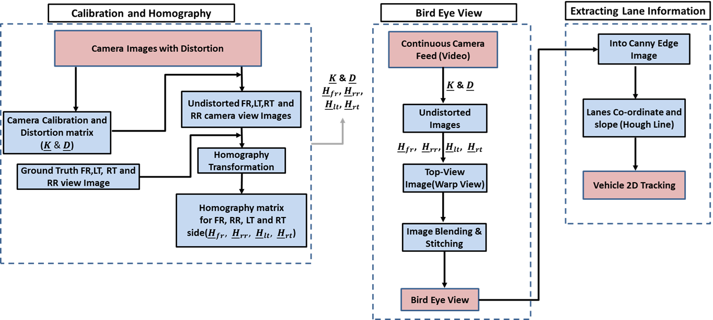
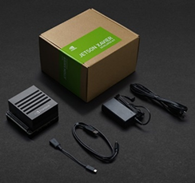
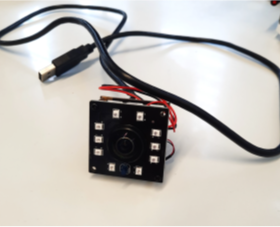
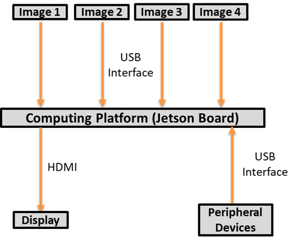
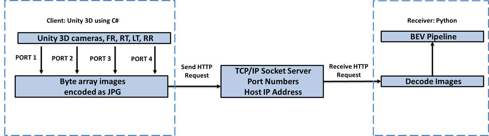

# Vehicle-Centric-All-Around-Bird's-Eye-Vew-Local-Mapping
This work involves creating a Bird's Eye Vew (BEV) local map where the position of the vehicle with respect to the road can be viewed from a prespective transformed top view. BEV is commonly used for environmental perception as it clearly presents the location and scale of objects (lanes and the vehicle in this case). The focus is getting a higher FPS or cycle time on the BEV view that allows faster tracking of the dynamically changing trajectories. This is also a crucial factor for time-critical applications like autonomous driving and collision avoidance.
The objectives of this work are listed below:
  1. Creating BEV from four fish-eye cameras.
  2. 2D Vehicle positioning and heading information.
  3. Both tasks must be performed in simulation, i.e., Unity and Real hardware (NVIDIA Jetson Xavier).
  4. Output to be 15-30 FPS.

# BEV and Vehicle Position Pipeline:

The Pipeline is divided broadly into three components based on the workflow and division.
  1. Calibration and Homography (Run once in the PC).
  2. Seamless BEV (Runs continuously in Jetson).
  3. Extracting Lane Information or Vehicle 2D Position (Runs continuously in Jetson).

# Requirements:
  1. Unity (2021.3.15.f1 or later)
  2. Computing Platform( e.g. NVDIA Jetson Xavier)
     
  4. Four Cameras (e.g. Fish Eye Camera)
     
  5. Auxiliary hardwares (Display, I/O devices, USB Interfaces)
     
  7. Python 3.3.8
  8. OpenCV 4.6.0
  9. Connectivity between Unity and Python using TCP/IP.
     

# Results
1. The first video shows the hardware implementation on the top left shows the test bench's heading and relative position from the lane, and center image is the BEV from four camera, top right shows the test setup as its driving(click on the image to watch the video).

2. The sencond video shows the unity implementation on the top left window shows the BEV with Car's heading and relative position from the lane, and center window is the unity simulator as the user drives the Car(click on the image to watch the video).

